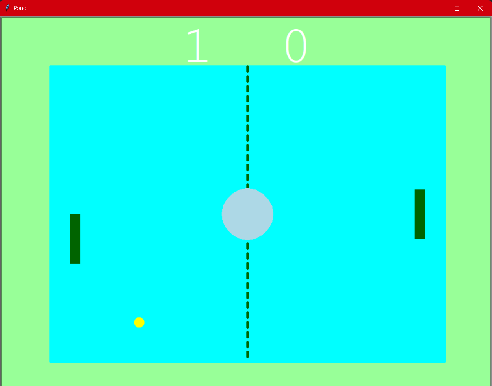
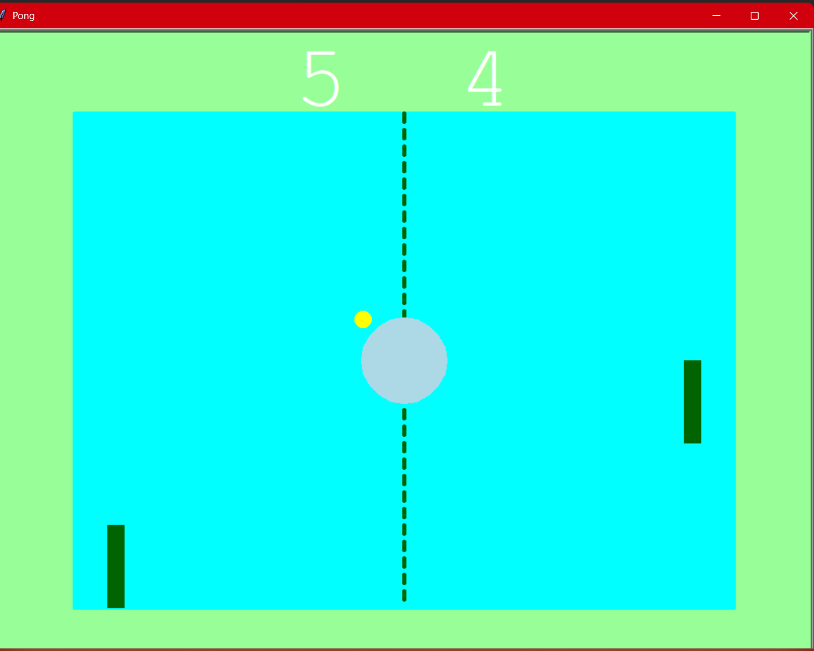

# Pong Game 🎾

A classic 2-player Pong game implemented in Python using the `turtle` module. Players control paddles to bounce the ball and score points against each other.

---

## Features

* Two-player paddle control:

  * Right paddle: Up / Down arrow keys
  * Left paddle: W / S keys
* Ball movement with realistic bouncing off paddles and walls
* Scoreboard tracking left and right player scores
* Smooth gameplay with adjustable ball speed
* Visual game arena with borders, center line, and center circle

---

## Screenshots




---

## Installation & Running

1. Clone the repository:

```bash
git clone https://github.com/Aashutosh99/Pong-Game.git
```

2. Make sure Python 3 is installed.

3. Run the game:

```bash
python main.py
```

---

## Project Structure

```
Pong-Game/
│
├── main.py             # Main game loop
├── paddle.py           # Paddle class
├── ball.py             # Ball class
├── scoreboard.py       # Scoreboard class
├── background.py       # Background visuals
├── screenshots/        # Folder for screenshots
│    ├── screenshot1.png
│    └── screenshot2.png
└── README.md           # Project documentation
```

---

## Controls

* **Right Paddle:**

  * Up: `Arrow Up`
  * Down: `Arrow Down`

* **Left Paddle:**

  * Up: `W`
  * Down: `S`

---

## Notes

* The game window size is 1000x800 by default.
* The ball resets when it goes out of bounds, and the corresponding player's score increases.

---

## License

This project is open-source and available under the MIT License.
